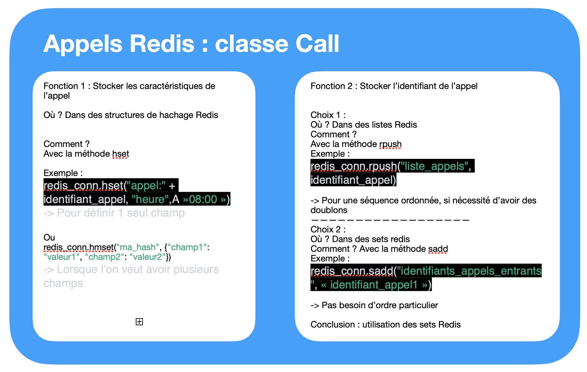

# Projet Redis 

# Structure 
Composé de 2 fichiers principaux :

Operator.py : 

Call.py 

## Implémentation avec Redis 



On a choisit d'utiliser des hashs redis pour stocker les informations des appels et des sets afin de stocker les identifiants des appels.


## Philosophie 
On voulait des classes flexibles d'utilisation
La philosophie adoptée dans le projet est de pouvoir retravailler sur un objet facilement dans n'importe quelle partie d'un code :
```
list_call = Call.list_call()
print(list_call)
id_call_1 = list_call([0]['id']) # on passe l'id d'un appel afin de travailler sur l'objet
call1 = Call.get_isntance_by_id(id_call_1)
```
## Exemples 
````


```

# Problèmes Rencontrés 
## Les données Redis doivent être envoyées en binaire 